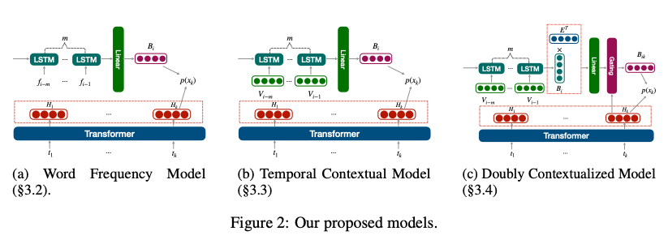

 # FUTURE LANGUAGE MODELING FROM TEMPORAL DOCUMENT HISTORY

 ### Problem to solve

 - introduce the task of future language modeling: probabilistic modeling of texts in the future based on a temporal history of texts 
 - our work is the first work to formalize the task of predicting the future in this way
 - show that it is indeed possible to build future language models that improve upon strong non-temporal language model baselines, opening the door to working on this important, and widely applicable problem

 ### Motivation

 - predicting the future is of great interest across many aspects of human activity
 - businesses are interested in future trends, traders are interested in future stock prices, and companies are highly interested in future technological breakthroughs
 - while there are many automated systems for predicting future numerical data, such as weather, stock prices, and demand for products, there is relatively little work in automatically predicting textual data
 - textual data holds unique significance, given that it is a natural and rich format for human consumption
 - this work aims to address this gap by introducing a novel task – future language modeling
-  The future language modeling task is to construct a generative language model for future text given a temporal history of documents
- show, by construction, that future language models can be built that perform better, across various automatic and manual evaluations, than non-temporal language models trained on the most up-to-date text

 ### Cotributions

- introduce the future language modeling task of modeling future textual content using a history of documents, as well as evaluation methods for this task 
- develop a series of future language models for this task that incorporate temporal information into pre-trained language models, which dynamically adjusts the generation probability to generate content that follows the predicted future trend
- evaluate our model to model future abstracts for ACL conference papers, and our proposed approach outperforms the baseline model on both automatic metrics and human evaluation

### Method

- develop three methods for future language models:
    - a word frequency model
    - a contextual temporal model
    - a doubly contextualized temporal model
- All the above methods modify the language model probabilities to account for the temporal evolution. A language model usually calculates the probabilities with a softmax equation:

<p align="center">
  
</p>

- first two methods compute a temporal bias B<sub>iw</sub> ∈ R for the wth word in the ith year that is calculated from the previous years
- the bias term up-weights or down-weights vocabulary items to account for changes across years
- The bias is added into the softmax equation to modify the probabilities:

<p align="center">
  
</p>

- third method is more expressive, and calculates a contextualized bias term that depends on the previous words x<sub>1</sub>...x<sub>k−1</sub> that have been generated
-  This allows the bias term to be contextualized in the output that is being generated
- the softmax probability equation becomes:

<p align="center">
  
</p>

- For training, all future language models are trained with standard cross-entropy loss

<p align="center">
  
</p>

#### THE WORD FREQUENCY MODE

- simplest method models the change over time of the frequency of the words without using any context from historical document
- it only uses the raw counts of the word over time to compute bias
- this bias is added to the final softmax to bias the model towards historical trends
-  intuition is to use a temporal neural network to try to predict biases for words based on historical frequency data of words
- use an auto-regressive RNN-style model, specifically an LSTM, rather than a Transformer model for this because it is more naturally suited to our temporal task, as LSTMs do not use position embeddings
- Figure 2a shows the model overview
- use the last hidden vector of the LSTM followed by a dot product with a learned vector A ∈ R<sup>d</sup> to compute the bias

<p align="center">
  
</p>


#### THE TEMPORAL CONTEXTUAL MODEL
- to account for contextualized information contained in prior abstracts, a temporally contextualized model is developed
- created a pooled representation for each year for each word and use an average of the contextualized embeddings, averaged over all instances of that word over the year
-  then feed the contextualized embedding into an LSTM to predict the temporal word bias
- representation for the wth word in the vocabulary for the ith year is the average of the contextualized embeddings, which can be expressed as:

<p align="center">
  
</p>

- use the fact that more recent years have more influence on future texts and propose a window-sized modeling approach
- The window size determines how many previous years for word embedding we consider to predict the next year’s temporal bias
- Let m be the window size for each year, then we compute a temporal bias Biw ∈ R<sup>d</sup> from m previous year’s word embedding as follows:

<p align="center">
  
</p>

-  Figure 2b shows the model overview
- also experimented with combining the word frequency model and the temporal contextual model, but we did not observe any improvement by additively combining them

#### THE DOUBLY CONTEXTUALIZED MODEL

- hypothesize that the contextual model can predict good terms to use, but cannot decide when to rely on the temporal contextual model versus relying on the prior state in the language model (for example, reusing a previous term in the document versus introducing a new fashionable term)
- the model appears to need a “gating” mechanism to decide when to use the new suggested terms
-  introduce a mechanism that contextualizes the temporal contextual model when generating a document – a doubly contextualized model that is contextualized both temporally and in the document generation
- Figure 2c shows the model overview
- matching B<sub>iw</sub> with the pre-trained model embedding space and reduce the dimension of vocabulary size
- enable temporal bias B<sub>iw</sub> to tie with the word embedding layer weights for each word E<sub>w</sub> ∈ R d<sup>d</sup> and conduct a linear projection

<p align="center">
  
</p>

- Then we compute the sigmoid attention between transformer decoder output H<sub>k</sub> and B<sub>iw</sub> to obtain the B<sub>ikw</sub> ∈ R<sup>d</sup> as follows:

<p align="center">
  
</p>

### Results
Read from paper for better understanding

### Reference

```bibtex
@article{li2024future,
  title={Future language modeling from temporal document history},
  author={Li, Changmao and Flanigan, Jeffrey},
  journal={arXiv preprint arXiv:2404.10297},
  year={2024}
}