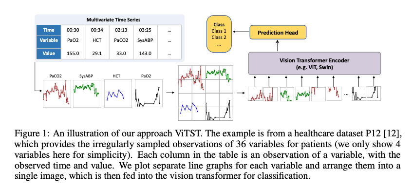
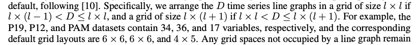

 # Time Series as Images: Vision Transformer for Irregularly Sampled Time Series

 ### Problem to solve

 - irregularly sampled time series are increasingly prevalent, particularly in medical domains
 - introduces a novel perspective by converting irregularly sampled time series into line graph images, then utilizing powerful pretrained vision transformers for time series classification in the same way as image classification
 - method exhibits strong robustness against varying degrees of missing observations

 ### Motivation

 - previous methods typically assume fully observed data at regular intervals and fixed-size numerical inputs
 - consequently, these methods encounter difficulties when faced with irregularly sampled time series, which consist of a sequence of samples with irregular intervals between their observation times
 - ViTST (Vision Time Series Transformer), which involves transforming irregularly sampled multivariate time series into line graphs, organizing them into a standard RGB image format, and finetuning a pre-trained vision transformer for classification using the resulting image as input. An illustration of our method can be found in Figure 1
 - line graphs can capture crucial patterns, such as the temporal dynamics represented within individual line graphs and interrelations between variables throughout separate graphs
 - such a visualization technique benefits our approach because it is both simple and intuitively comprehensible to humans, enabling straightforward decisions for time series-to-image transformations
-  Leveraging vision models for time series modeling in this manner mirrors the concept of **prompt engineering**

 ### Cotributions

- propose a simple yet highly effective approach for multivariate irregularly sampled time series classification. Despite its simplicity, our approach achieves strong results against the highly specialized SoTA methods
- approach demonstrates excellent results on both irregular and regular time series data, showcasing its versatility and potential as a general-purpose framework for time series modeling. It offers a robust solution capable of handling diverse time series datasets with varying characteristics
- work demonstrates the successful transfer of knowledge from vision transformers pre-trained on natural images to synthetic visualized time series line graph images

### Method

- ViTST consists of two main steps:
    - transforming multivariate time series into a concatenated line graph image
    - utilizing a pre-trained vision transformer as an image classifier for the classification task
- framework has two components:
    - a function that transforms the time series S<sub>i</sub> into an image x<sub>i</sub>

<p align="center">
  
</p>

#### Time Series to Image Transformation

- use marker symbols “∗” to indicate the observed data points in the line graph
- creating patient representation is explained in figure 2 along with token descriptions and their usage
- plot the observations of each variable in an individual line graph, as shown in Fig. 1 since the scales of different variables may vary significantly
- The scales of each line graph are kept the same across different time series
- employ distinct colors for each line graph for differentiation
- followed the following for creating grid 

<p align="center">
  
</p>

- any grid spaces not occupied by a line graph remain empty

#### Vision Transformer for Time Series Modeling
- the time series patterns in a line graph image involve both local (i.e., the temporal dynamics of a single variable in a line graph) and global (the correlation among variables across different line graphs) contexts
- to better capture these patterns, vision transformers are chosen as they are proven to excel at maintaining spatial information and have stronger abilities to capture local and global dependencies unlike CNNs
-  use Swin Transformer as the default backbone vision model due to better computational cost 


### Results
Read from paper for better understanding
#### Evaluation metrices
- Area Under a ROC Curve (AUROC)
- Area Under Precision-Recall Curve (AUPRC)
- For the more balanced dataset, Accuracy, Precision, Recall, and F1 score are used

### Reference

```bibtex
@article{li2023time,
  title={Time series as images: Vision transformer for irregularly sampled time series},
  author={Li, Zekun and Li, Shiyang and Yan, Xifeng},
  journal={Advances in Neural Information Processing Systems},
  volume={36},
  pages={49187--49204},
  year={2023}
}