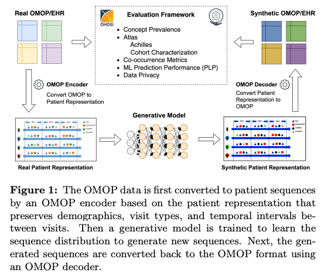
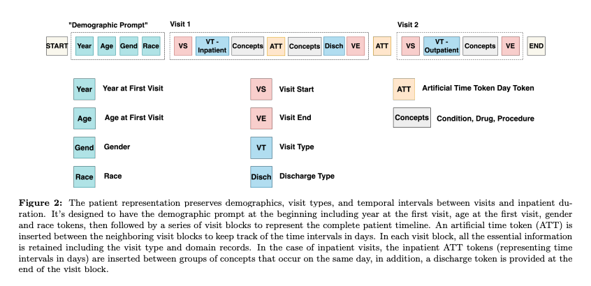

 # CEHR-GPT: Generating Electronic Health Records with Chronological Patient Timelines

 ### Problem to solve
 - generate synthetic Electronic Health Records (EHR) with GPT
 - the original EHR have a privacy, security, issues, institutional consent and restrictions on data sharing

 ### Motivation
 - synthetic data which mimics the characteristics of the orignal patient data is used as solution to solve the above mentioned issues
 - previous solutions fails to capture temporal dependencies like medication schedules, symptom progression, and lab results timelines in the generated data
 - the synthetic data should have:
    - similar outcome prevalence to source data
    - achieve same performance as of original data when training a model on synthetic data
- the time series synthetic data should not only captuee the underlying characteristics of hoterogeneous EHRs but also satisfy the following temporal requirements:
    - a matching distribution of the starting age
    - a matching distribution of the starting year
    - a matching distribution of inpatient duration
    - a matching distribution of time intervals between neighboring visits
- furthermore,synthetic EHR data should be stored in common data models such as the Observational Medical Outcomes Partnership (OMOP) Common Data Model
- uses patient representation approach to focus on designing a good patient representation rather than creating a sophisticated architecture to model time and medical events simultaneously

 ### Cotributions
- design a novel patient representation that captures visit types, discharge facilities for inpatient visits, and all temporal data, such as starting year, age, intervals between visits, and inpatient visit duration
- uses GPT to learn the distribution of patient sequences to generate new synthetic sequences
-  converted synthetic sequences to the common data format OMOP with almost no loss of temporal information
- evaluated the synthetic EHR data on three levels, dimension-wise distribution (marginal distribution) co-occurrence relationship, and machine learning model performance metrics
- utilized the state-of-the-art evaluation framework proposed by (Yan et al.) to quantify the privacy risk by calculating a number of privacy metrics for synthetic Electronic Health Records (EHR) data

### Method
- present the framework for generating synthetic EHR data from an OMOP source
- work directly with timeseries patient sequences instead of using a bag-of-words (BOW) representation
- first encoded the OMOP data into patient sequences using a specific patient representation Secondly, trained a generative model on the converted patient sequences and utilized it to generate new synthetic patient sequences
- finally, fed the synthetic patient sequences into an OMOP decoder to create a synthetic OMOP dataset

<p align="center">
  
</p>

#### Patient Representation
- patient representation in (CEHR-BERT) captures medically relevant events and their timelines while exhibiting certain characteristics of a sentence. In order to fully leverage Large Language Models (LLM) on patient sequences, demographic information, patient history, and temporal dependencies are included as shown in Figure 2.
- creating patient representation is explained in figure 2 along with token descriptions and their usage

<p align="center">
  
</p>

#### OMOP Encoder
- to create a patient sequence, a demographic prompt using data from the OMOP person and visit tables is generated.
-  added all the tokens in the sequence as mentioned in figure 2

#### Generative Model
- a GPT model with standard transformer decoders, where the input layer utilized concept embedding and trainable positional embedding. 
- the model was trained using the Next Word Prediction learning objective.

#### OMOP Decoder
- the patient sequence was converted back to the OMOP format using the OMOP decoder
- the start-year prompt determined the EHR history’s beginning, using January 1st as the default
- demographic data was stored in the person table, while concepts were transformed into condition, drug, and procedure tables
- the VS token marked the start of a new visit block. Therefore, extracted the token corresponding to the visit type (the token immediately followed by VS) and created a new visit record with the corresponding type.
- for outpatient visits, we assumed that all data points were generated on the same day; therefore, we set the start and end dates of the visit to the current value of the date cursor
-  for inpatient visits, the date cursor was updated inside the visit block based on the time intervals represented by IATT tokens between inpatient spans
- towards the end of the inpatient visit block, we extracted the last token (the token right before VE) corresponding to a discharge facility and updated the visit end date using the current value of the date cursor

### Results
Read from paper for better understanding
#### Evaluation metrices
- dimension wise distribution
- co-occurance relationship
- machine learning model performance

### Reference

```bibtex
@article{pang2024cehr,
  title={CEHR-GPT: Generating electronic health records with chronological patient timelines},
  author={Pang, Chao and Jiang, Xinzhuo and Pavinkurve, Nishanth Parameshwar and Kalluri, Krishna S and Minto, Elise L and Patterson, Jason and Zhang, Linying and Hripcsak, George and G{\"u}rsoy, Gamze and Elhadad, No{\'e}mie and others},
  journal={arXiv preprint arXiv:2402.04400},
  year={2024}
}