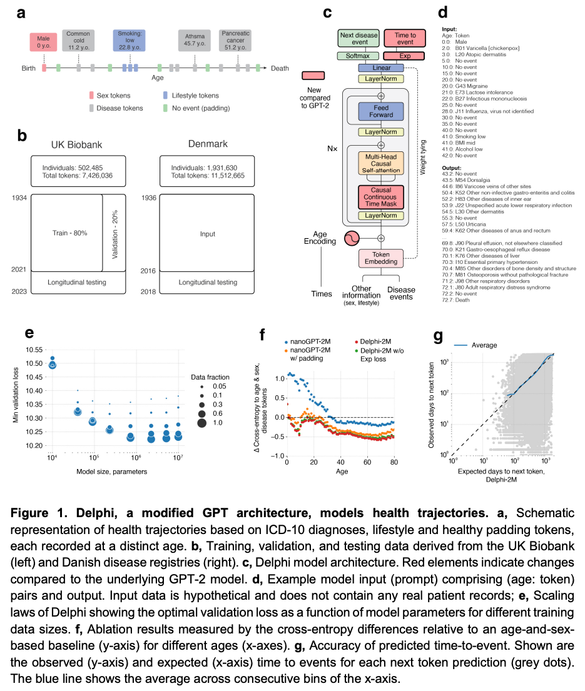
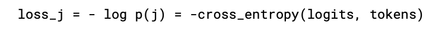
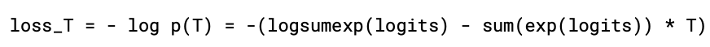

 # Learning the natural history of human disease with generative transformers

 ### Problem to solve
 
 - Artificial intelligence (AI) methods promise to aid this task by learning patterns of disease progression from large corpora of health records to predict detailed outcomes for an individual. However, the potential of AI has not yet been fully investigated at scale
 - the potential for comprehensive and generative multi-morbidity modelling has not yet been fully assessed

 ### Motivation
- Learning and predicting patterns of disease progression is also important in populations that are ageing and which exhibit shifts in their underlying demographic’s morbidities
- While a wide range of prediction algorithms exist for specific diseases from cardiovascular disease to cancer6–8 10 , few algorithms  are capable of predicting the full spectrum of human disease, which recognises more than  1,000 diagnoses at the top level of the ICD-10 (international classification of diseases, tenth  revision) coding system
 - GPT-based models appear well suited for predictive and generative health related tasks, are applicable to population scale health data sets and provide insights into the temporal dependencies of past events that shape future health, impacting our ability to obtain an instantaneous view of personalised health state

 ### Cotributions

 - modify the GPT (generative pretrained transformer) architecture to model the temporal progression and competing nature of human diseases in a population scale cohort
 - Delphi-2M predicts the rates of more than 1,000 different ICD-10 coded diseases and death, conditional on each individual's past disease history, age, sex and baseline lifestyle information, and with accuracy comparable to existing single-disease models
 - Delphi-2M’s  generative nature also enables sampling future health trajectories at any point within an  individual’s life course with outcomes across the entire disease spectrum
 - Explainable AI methods provide insights into Delphi-2M’s predictions, revealing temporal clusters of co-morbidities within and across different disease chapters and their time-dependent consequences on the future health course


### Method
- to model disease history data, which, unlike text, occurs on a continuous time axis, an extended the GPT-2 architecture is used
- the first change thus replaces GPT’s positional encoding, a mapping that identifies each text token's discrete position, with an encoding of continuous age using sine and cosine basis functions
- the second extension is the addition of another output head also to predict the time to the next token using an exponential waiting time model
- third, GPT’s so-called causal attention masks, which ensure that the model only accesses information from past events, are amended to resolve ties of tokens recorded at the same time (we note that such temporal ordering does not imply the model is capable of identifying causal mechanisms in the sense of modifiable features)
- termed this model as Delphi (Delphi Large Predictive Health Inference)

<p align="center">
  
</p>

#### Data Respresentation and padding tokens
- each data point consists of pairs (token, age) recording the token value and the proband’s age, measured in days from birth, at which the token was recorded
- the token vocabulary consists of n=1257 different ICD-10 level 3 disease tokens, plus n=9 tokens for alcohol, smoking and BMI, each represented by 3 different levels, as well as n=2 tokens for sex and n=1 no-event padding token as well as n=1 additional, non informative padding token at the beginning or end of the input sequences
- No-event padding tokens were added to the data with a constant rate of 1/5 years by uniformly sampling 20 tokens from the range of (0, 36525) and interleaving those with the data tokens after intersecting with the data range for each person


#### Age encoding
- Delphi replaces GPT’s positional encoding with an encoding based on the age values
-  Following the logic frequently used for positional encodings, age is represented by sine and cosine functions of different frequencies, where the lowest frequency is given by 1/(100*365), corresponding to a linear and constant basis function each

#### Casual self-attention
- in the case of time-dependent data, tokens can be recorded at the same time with no specified order. Thus, attention masks were amended to mask positions that occurred at the same time as the predicted token
- Non-informative padding tokens were masked for predictions of other tokens

#### Loss functions
- two loss functions for two heads are as follows:

<p align="center">
  
</p>

<p align="center">
  
</p>


#### Sampling procedure
- the next disease event is sampled by sampling the disease token and the time until the next event
- the disease token is sampled from the distribution that originates from applying softmax to logits
- for sampling the time, samples from all exponential distributions with rates exp(λi) are taken, and the minimum is taken
- logits of non-disease tokens (sex, lifestyle) are discarded from the procedure to sample disease events only

### Results
Read from paper for better understanding


### Reference

```bibtex
@article{shmatko2024learning,
  title={Learning the natural history of human disease with generative transformers},
  author={Shmatko, Artem and Jung, Alexander Wolfgang and Gaurav, Kumar and Brunak, S{\o}ren and Mortensen, Laust and Birney, Ewan and Fitzgerald, Tom and Gerstung, Moritz},
  journal={medRxiv},
  pages={2024--06},
  year={2024},
  publisher={Cold Spring Harbor Laboratory Press}
}